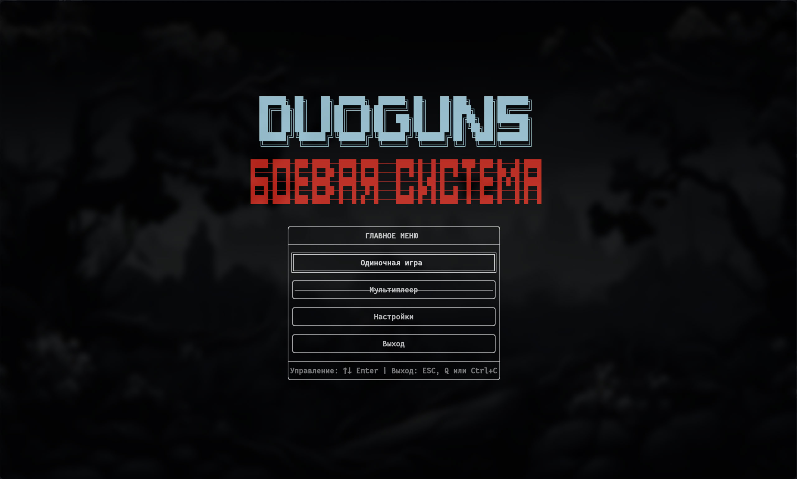
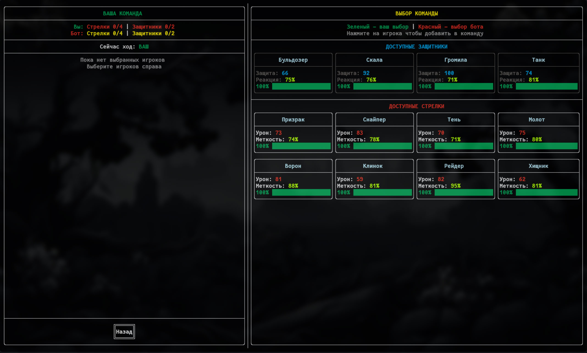
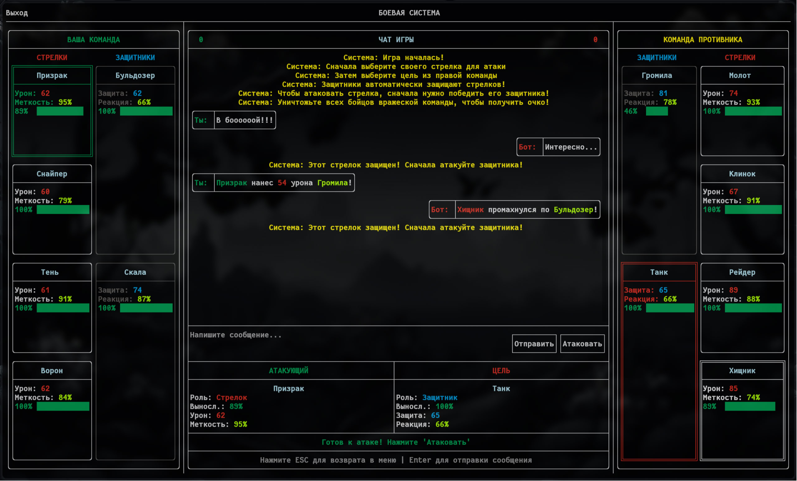

# Дуэль гангстеров (DuoGuns)

Консольная игра на C++ с использованием библиотеки [FTXUI](https://github.com/ArthurSonzogni/FTXUI) для создания красивого TUI (Text-based User Interface). Стратегическая пошаговая дуэль между двумя командами гангстеров.

## 🎯 Основные правила

- **2 команды**, по 6 участников в каждой (4 стрелка + 2 охранника)
- **Пошаговый бой** - команды атакуют по очереди
- **Условие победы** - первая команда, набравшая 5 успешных атак
- **Система защиты** - охранники автоматически защищают стрелков

## ⚡ Характеристики персонажей

### 🎯 Стрелки (Shooters):
- **Урон от выстрела**: 50-90
- **Меткость**: 70-95%
- **Основная роль**: нанесение урона

### 🛡️ Охранники (Defenders):
- **Защита**: 60-100
- **Реакция**: 65-90%
- **Основная роль**: защита стрелков

### ❤️ Общие характеристики:
- **Выносливость**: 100% (снижается после каждой атаки)
- **Живучесть**: персонаж выбывает при достижении 0% выносливости

## 🔧 Механика игры

### ⚔️ Система боя:
- **Сравнение характеристик**: атака vs защита
- **Шанс попадания**: зависит от соотношения сил атакующего и защитника
- **Динамический баланс**: характеристики снижаются при потере выносливости
- **Умный ИИ**: бот выбирает оптимальные цели для атаки

### 🎲 Случайные события (15% шанс):
- **Стрелок**: "Осечка!" → урон -20%
- **Охранник**: "Потерял позицию!" → защита -20%

### 👊 Разборка (при ничье 4:4)
- Участвуют все **стрелки.**
-	**Сила** считается без учёта **выносливости**, но с проверкой **меткости**.

### ⚙️ Дополнительные параметры
Тактика группировки:
- **Агрессивная**: +15% к атаке, но +20% усталость.
- **Осторожная**: +15% к защите, но -10% к атаке.
- **Обычный**: Без изменений

## 🔴 НЕ ВЫПОЛНЕНО

**🌐 Мультиплеер**
- ❌ Режим игры для двух игроков


## 🏗️ Архитектура проекта

```
├── application.h/.cpp           # Главный класс приложения
├── mainmenu.h/.cpp              # Главное меню
├── main.cpp                     # Вход
├── teamselectionscreen.h/.cpp   # Экран выбора команд
├── battlecontroller.h/.cpp      # Контроллер боя
├── battleview.h/.cpp            # Представление боя
├── gameengine.h/.cpp            # Игровой движок
├── defensesystem.h/.cpp         # Система защиты
├── team.h/.cpp                  # Команда персонажей
├── gaster.h/.cpp                # Базовый класс персонажа
├── shooter.h/.cpp               # Класс стрелка
├── defender.h/.cpp              # Класс охранника
├── gastergenerator.h/.cpp       # Генератор персонажей
├── chatmanager.h/.cpp           # Менеджер чата
├── chatmessage.h/.cpp           # Сообщение чата
└── config.h                     # Конфигурация игры
```

## 📚 Детальное описание классов и методов

### 🎮 Application (application.h/.cpp)
**Главный управляющий класс приложения**

### 🎪 MainMenu (mainmenu.h/.cpp)
**Система главного меню с красивым ASCII-интерфейсом**

### 👥 TeamSelectionScreen (teamselectionscreen.h/.cpp)
**Экран выбора команд с пошаговым выбором**

### ⚔️ BattleController (battlecontroller.h/.cpp)
**Ядро игровой логики, управляет всем процессом боя**

### 🎨 BattleView (battleview.h/.cpp)
**Система отображения боя с интерактивным интерфейсом**

### 🔧 GameEngine (gameengine.h/.cpp)
**Игровой движок с расчетом механики боя**

### 🛡️ DefenseSystem (defensesystem.h/.cpp)
**Система защиты и распределения охранников**

### 👥 Team (team.h/.cpp)
**Управление командой персонажей**

### 🎭 Gaster (gaster.h/.cpp)
**Базовый абстрактный класс для всех персонажей**

### 🎯 Shooter (shooter.h/.cpp)
**Класс стрелка - специализированный тип персонажа**

### 🛡️ Defender (defender.h/.cpp)
**Класс охранника - специализированный тип персонажа**

### 🎲 GasterGenerator (gastergenerator.h/.cpp)
**Фабрика по созданию случайных персонажей**

### 💬 ChatManager (chatmessage.h/.cpp)
**Система игрового чата и уведомлений**

### 📨 ChatMessage (chatmessage.h/.cpp)
**Модель данных для сообщений чата**

### ⚙️ Config (config.h)
**Централизованная конфигурация всех параметров игры**

## 🖼️ Скриншоты интерфейса

### Главное меню


### Выбор команды  


### Боевой интерфейс


## 🚀 Сборка и запуск

```bash
# Клонирование репозитория
git clone https://github.com/B00gor/DuoGuns.git
cd DuoGuns

# Сборка проекта
mkdir build
cd build
cmake ..
make

# Запуск игры
./DuoGuns
```

## 📋 Требования

- **Компилятор** с поддержкой C++20
- **CMake** версии 3.16 или выше
- **Библиотека FTXUI** для текстового интерфейса

## 🎯 Особенности реализации

- **Чистая архитектура** с разделением ответственности
- **Расширяемая система** персонажей и характеристик
- **Интеллектуальный ИИ(типо)** с тактическим выбором целей
- **Интерактивный интерфейс** с полноценной навигацией
- **Гибкая система настроек** баланса игры
- **Модульная структура** для легкого расширения

Проект демонстрирует практику объектно-ориентированного программирования и создания сложных консольных приложений на C++.
